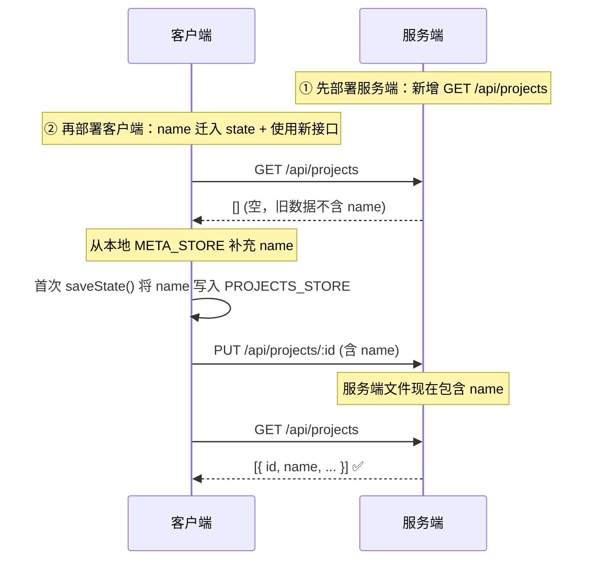

# meta.projects 服务端迁移技术方案

## 一、现状分析

### 1.1 当前架构

项目元信息（`projects` 数组）完全在客户端管理：

```
┌─ 客户端 IndexedDB ─────────────────────────────────────────────────┐
│                                                                    │
│  META_STORE (keyPath: 'key')                                       │
│  ├── 'projects'          → [{ id, name, screenshotCount }, ...]    │
│  ├── 'currentProject'    → "project_1712345678"                    │
│  └── 'remoteVersion_*'   → 1712345678000                           │
│                                                                    │
│  PROJECTS_STORE (keyPath: 'id')                                    │
│  └── 'project_1712345678' → { id, _version, screenshots, ... }     │
│                              ⚠️ 不包含 name 字段                    │
│                                                                    │
└────────────────────────────────────────────────────────────────────┘

┌─ 服务端 ───────────────────────────────────────────────────────────┐
│                                                                    │
│  data/projects/{id}/{timestamp}.json                               │
│                              ⚠️ 存储完整 project JSON，不含 name    │
│                                                                    │
│  API:                                                              │
│  ├── GET  /api/projects/:id    → 获取单个项目                      │
│  ├── PUT  /api/projects/:id    → 保存/更新项目                     │
│  ├── DELETE /api/projects/:id  → 删除项目                          │
│  └── ❌ 无项目列表接口                                              │
│                                                                    │
└────────────────────────────────────────────────────────────────────┘
```

**问题：**

1. **`name` 字段孤岛** — 项目名仅存在于客户端 META_STORE，不在 PROJECTS_STORE 也不在服务端。换浏览器/清缓存后项目名丢失，回退为 "Default Project"。
2. **无服务端项目列表** — 服务端不知道有哪些项目存在，无法跨设备同步项目列表。
3. **数据冗余** — `screenshotCount` 需要客户端手动维护和 `saveProjectsMeta()` 调用保持一致。

### 1.2 关键代码路径

| 组件 | 文件 | 关键函数 |
|------|------|----------|
| 项目列表加载 | `src/web/app.js:1390` | `loadProjectsMeta()` — 从 META_STORE 读取 |
| 项目列表保存 | `src/web/app.js:1421` | `saveProjectsMeta()` — 写入 META_STORE |
| 项目创建 | `src/web/app.js:2210` | `createProject(name)` — push 到本地数组 + saveProjectsMeta |
| 项目重命名 | `src/web/app.js:2219` | `renameProject(newName)` — 修改本地数组 + saveProjectsMeta |
| 项目删除 | `src/web/app.js:2266` | `deleteProject()` — splice 数组 + saveProjectsMeta + apiDeleteProject |
| 项目复制 | `src/web/app.js:2284` | `duplicateProject()` — push 新项 + saveProjectsMeta |
| 截图数量更新 | `src/web/app.js:1753` | `saveState()` — 更新 screenshotCount + saveProjectsMeta |
| 项目选择器渲染 | `src/web/app.js:1529` | `updateProjectSelector()` — 遍历 projects 数组渲染 UI |
| 状态保存 | `src/web/app.js:1688` | `saveState()` — stateToSave 不包含 name |
| 状态加载 | `src/web/app.js:1821` | `loadState()` — 从 PROJECTS_STORE 加载 |
| 服务端存储 | `src/server/storage.js:17` | `saveProject(id, data)` — 原样存储 JSON |
| 同步 Worker | `src/web/sync-worker.js:154` | 仅 PUT 项目数据，不涉及 name |

---

## 二、迁移目标

### 2.1 总体目标

| 项目 | 变更 |
|------|------|
| `name` 字段 | 从 META_STORE 迁移到 PROJECTS_STORE（state 中），使其随 `saveState()` 自动同步到服务端 |
| 项目列表 | 服务端提供 `GET /api/projects` 接口，通过扫描 `data/projects/` 目录返回所有项目的 meta |
| 客户端 `projects` 数组 | 从服务端接口获取，本地 IndexedDB 仅做缓存 |

### 2.2 目标架构

```
┌─ 客户端 ───────────────────────────────────────────────────────────┐
│                                                                    │
│  META_STORE (keyPath: 'key')                                       │
│  └── 'currentProject'    → "project_1712345678"                    │
│  └── 'remoteVersion_*'   → 1712345678000                           │
│      ⚠️ 'projects' key 已移除                                       │
│                                                                    │
│  PROJECTS_STORE (keyPath: 'id')                                    │
│  └── 'project_1712345678' → { id, _version, name, screenshots,     │
│                                outputDevice, ... }                  │
│                              ✅ 包含 name 字段                       │
│                                                                    │
│  GET /api/projects  → 获取项目列表 [{ id, name, lastModified }]    │
│                                                                    │
└────────────────────────────────────────────────────────────────────┘

┌─ 服务端 ───────────────────────────────────────────────────────────┐
│                                                                    │
│  data/projects/{id}/{timestamp}.json                               │
│                              ✅ 文件中包含 name 字段                │
│                                                                    │
│  API:                                                              │
│  ├── GET    /api/projects       → 🆕 扫描目录，返回项目列表        │
│  ├── GET    /api/projects/:id   → 获取单个项目                     │
│  ├── PUT    /api/projects/:id   → 保存/更新项目                    │
│  └── DELETE /api/projects/:id   → 删除项目                         │
│                                                                    │
└────────────────────────────────────────────────────────────────────┘
```

---

## 三、实现方案

### 3.1 阶段一：服务端 `GET /api/projects` 接口

#### 3.1.1 `src/server/storage.js` — 新增 `listProjects()`

```js
const fs = require('fs');
const path = require('path');

const PROJECTS_DIR = path.join(__dirname, '..', '..', 'data', 'projects');

/**
 * 扫描 projects 目录，返回所有项目元信息列表
 * @returns {Promise<Array<{id: string, name: string, lastModified: number, screenshotCount: number}>>}
 */
async function listProjects() {
    ensureDir(PROJECTS_DIR);

    const entries = fs.readdirSync(PROJECTS_DIR, { withFileTypes: true });
    const projects = [];

    for (const entry of entries) {
        if (!entry.isDirectory()) continue;

        const projectId = entry.name;
        const projectDir = path.join(PROJECTS_DIR, projectId);

        // 读取最新版本的文件
        const files = fs.readdirSync(projectDir)
            .filter(f => f.endsWith('.json'))
            .sort()
            .reverse();

        if (files.length === 0) continue;

        const latestFile = files[0];
        const filePath = path.join(projectDir, latestFile);
        const stat = fs.statSync(filePath);

        try {
            const raw = fs.readFileSync(filePath, 'utf-8');
            const data = JSON.parse(raw);

            projects.push({
                id: projectId,
                name: data.name || 'Untitled',
                lastModified: stat.mtimeMs,
                screenshotCount: data.screenshots ? data.screenshots.length : 0
            });
        } catch (e) {
            // 损坏的 JSON 文件跳过，或返回兜底信息
            projects.push({
                id: projectId,
                name: 'Corrupted',
                lastModified: stat.mtimeMs,
                screenshotCount: 0
            });
        }
    }

    // 按最后修改时间降序排列
    projects.sort((a, b) => b.lastModified - a.lastModified);
    return projects;
}

module.exports = { saveProject, loadProject, deleteProject, listProjects };
```

#### 3.1.2 `src/server/server.js` — 新增路由

```js
// GET /api/projects — 获取项目列表
app.get('/api/projects', async (req, res) => {
    try {
        const projects = await storage.listProjects();
        res.json(projects);
    } catch (err) {
        console.error('Error listing projects:', err);
        res.status(500).json({ error: 'Failed to list projects' });
    }
});
```

### 3.2 阶段二：将 `name` 迁移到 state

#### 3.2.1 `stateToSave` 中加入 `name`

修改 `saveState()` (`src/web/app.js:1688`)，在 `stateToSave` 对象中加入 `name`：

```js
const stateToSave = {
    id: currentProjectId,
    _version: state._version,
    formatVersion: 2,
    name: state.projectName || 'Untitled',  // 🆕
    screenshots: screenshotsToSave,
    selectedIndex: state.selectedIndex,
    // ... 其他字段不变
};
```

#### 3.2.2 `loadState()` 中恢复 `name`

修改 `loadState()` (`src/web/app.js:1821`)，从 PROJECTS_STORE 读取后恢复 `name`：

```js
if (parsed) {
    // ... 现有逻辑 ...
    state.projectName = parsed.name || '';  // 🆕 从 state 中恢复 name
}
```

#### 3.2.3 `state` 对象增加 `projectName` 字段

在 `state` 对象定义处 (`app.js` 顶部) 添加：

```js
let state = {
    projectName: '',           // 🆕 项目名称
    screenshots: [],
    selectedIndex: 0,
    // ... 其他字段不变
};
```

#### 3.2.4 `resetStateToDefaults()` 中重置 `name`

```js
function resetStateToDefaults() {
    // ... 现有逻辑 ...
    state.projectName = '';     // 🆕
    // 或者从 projects 数组中查找当前项目的 name
}
```

#### 3.2.5 项目创建/重命名适配

**`createProject(name)`** — 设置 `state.projectName` 并在首次 `saveState()` 时写入：

```js
async function createProject(name) {
    const id = 'project_' + Date.now();
    state.projectName = name;
    // projects 数组需要同步更新（供客户端缓存用）
    projects.push({ id, name, screenshotCount: 0 });
    saveProjectsMeta();  // 本地缓存
    await switchProject(id);
}
```

**`renameProject(newName)`** — 修改 `state.projectName` 并 `saveState()`：

```js
function renameProject(newName) {
    state.projectName = newName;
    // 同步更新本地 projects 数组缓存
    const project = projects.find(p => p.id === currentProjectId);
    if (project) project.name = newName;
    saveProjectsMeta();  // 更新本地缓存
    saveState();         // 持久化到 PROJECTS_STORE + 同步到服务端
    updateProjectSelector();
}
```

### 3.3 阶段三：客户端项目列表从服务端获取

#### 3.3.1 `api-client.js` — 新增 `apiListProjects()`

```js
/**
 * 获取项目列表
 * @returns {Promise<Array<{id: string, name: string, lastModified: number, screenshotCount: number}>>}
 */
async function apiListProjects() {
    try {
        const resp = await fetch('/api/projects', { credentials: 'same-origin' });
        if (resp.status === 401) {
            window.location.href = '/login.html';
            return [];
        }
        if (!resp.ok) throw new Error(`HTTP ${resp.status}`);
        return await resp.json();
    } catch (err) {
        console.warn('Failed to fetch project list from server:', err);
        return null;  // null 表示服务端不可用
    }
}
```

#### 3.3.2 `app.js` — 修改 `init()` 加载流程

```js
async function loadProjectsFromServer() {
    const serverProjects = await apiListProjects();

    if (serverProjects) {
        // 服务端有数据：以服务端为准
        projects = serverProjects.map(p => ({
            id: p.id,
            name: p.name,
            screenshotCount: p.screenshotCount
        }));
        // 更新本地缓存
        saveProjectsMeta();
    } else {
        // 服务端不可用：回退到本地 IndexedDB 缓存
        await loadProjectsMeta();
    }
}

async function init() {
    try {
        await openDatabase();
        await loadProjectsFromServer();  // 🆕 优先从服务端获取
        await loadState();
        await pullLatestFromServer();
        initSyncWorker();
        syncUIWithState();
        updateCanvas();
    } catch (e) {
        console.error('Init failed:', e);
    }
}
```

#### 3.3.3 降级策略

| 场景 | 策略 |
|------|------|
| 服务端可用 | 以服务端 `GET /api/projects` 为准，本地 META_STORE 仅作备份缓存 |
| 服务端不可用（离线/网络错误） | 回退到本地 META_STORE 的 `projects` key |
| 初次使用（无本地无服务） | 使用默认 `{ id: 'default', name: 'Default Project' }` |
| 服务端返回空列表 | 使用空列表，用户需创建新项目 |

### 3.4 阶段四：清理和兼容

#### 3.4.1 数据兼容处理

`loadState()` 中处理旧项目数据（不含 `name` 字段）：

```js
// 兼容旧数据：从本地 projects 数组中查找 name
if (!parsed.name && parsed.id) {
    const meta = projects.find(p => p.id === parsed.id);
    parsed.name = meta ? meta.name : 'Untitled';
}
```

#### 3.4.2 上线顺序



由于 `listProjects()` 从 JSON 文件读取 `name`，旧数据首次保存后即拥有 `name` 字段，无需数据迁移脚本。

---

## 四、文件变更清单

| 文件 | 变更类型 | 说明 |
|------|----------|------|
| `src/server/storage.js` | 新增函数 | `listProjects()` — 扫描目录返回项目列表 |
| `src/server/server.js` | 新增路由 | `GET /api/projects` |
| `src/web/api-client.js` | 新增函数 | `apiListProjects()` |
| `src/web/app.js` — state 定义 | 新增字段 | `state.projectName` |
| `src/web/app.js` — `saveState()` | 修改 | `stateToSave` 加入 `name` |
| `src/web/app.js` — `loadState()` | 修改 | 从 state 恢复 `projectName`，兼容旧数据 |
| `src/web/app.js` — `createProject()` | 修改 | 同时设置 `state.projectName` |
| `src/web/app.js` — `renameProject()` | 修改 | 修改 `state.projectName` + `saveState()` |
| `src/web/app.js` — `init()` | 修改 | 改为从服务端加载项目列表 |
| `src/web/app.js` — `resetStateToDefaults()` | 修改 | 重置 `projectName` |

---

## 五、接口设计

### 5.1 `GET /api/projects`

**Response `200 OK`:**

```json
[
    {
        "id": "project_1712345678000",
        "name": "My App Screenshots",
        "lastModified": 1712345678000,
        "screenshotCount": 5
    },
    {
        "id": "project_1712345000000",
        "name": "Another Project",
        "lastModified": 1712345000000,
        "screenshotCount": 3
    }
]
```

| 字段 | 类型 | 来源 | 说明 |
|------|------|------|------|
| `id` | string | 目录名 | 项目唯一标识 |
| `name` | string | JSON 文件 `name` 字段 | 项目名称，旧数据默认为 "Untitled" |
| `lastModified` | number | 文件系统 mtime | 最后修改时间戳，用于排序 |
| `screenshotCount` | number | JSON 文件 `screenshots.length` | 截图数量 |

**排序规则：** 按 `lastModified` 降序排列，最近修改的项目排在前面。

**错误响应:**

```json
{ "error": "Failed to list projects" }
```

---

## 六、变更影响评估

| 影响项 | 风险等级 | 说明 |
|--------|----------|------|
| 下线兼容 | 低 | 服务端接口向后兼容，旧客户端不受影响。旧客户端不使用 `GET /api/projects` 接口，继续使用本地 META_STORE |
| 数据丢失 | 低 | 客户端保留了 META_STORE 缓存作为降级方案。name 在首次 `saveState()` 后即写入 PROJECTS_STORE |
| 性能 | 低 | `listProjects()` 仅在初始化时调用一次（约 1-2 次文件系统读取），后续项目变更使用本地缓存即时更新 |
| 同步问题 | 中 | 多设备同时修改项目名时，后保存的会覆盖先保存的（last-write-wins），与现有 `_version` 机制一致 |

---

## 七、测试要点

1. **全新用户** — 无本地数据、无服务端数据，应展示默认项目
2. **新服务端接口** — `GET /api/projects` 返回正确排序的项目列表，包含 name
3. **name 持久化** — 创建/重命名项目后断开网络 → 清缓存 → 重新打开，name 应从服务端恢复
4. **离线降级** — 断网情况下，从本地 META_STORE 加载项目列表
5. **旧数据兼容** — 升级前已存在的项目（state 中无 name），首次加载后自动补齐 name
6. **截图数量同步** — `screenshotCount` 在服务端通过扫描文件获取，不再依赖客户端手动维护
